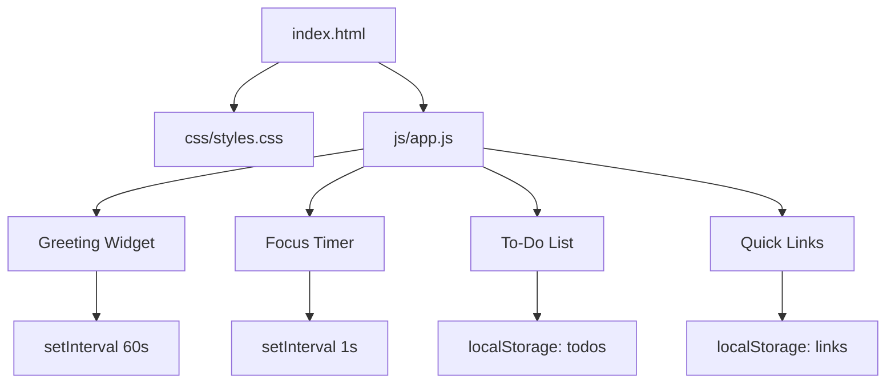

# Design Document: Personal Dashboard

## Overview

A single-page personal dashboard running entirely in the browser. No build step, no backend, no dependencies — just three files (HTML, CSS, JS) that open directly in any modern browser. All state is persisted to `localStorage` so the dashboard survives page refreshes.

The four widgets are:

| Widget | Purpose |
|---|---|
| Greeting | Shows current time, date, and a time-based greeting |
| Focus Timer | 25-minute Pomodoro countdown with start/stop/reset |
| To-Do List | Task CRUD with completion toggling and persistence |
| Quick Links | Saved URL shortcuts that open in a new tab |

---

## Architecture

The app follows a simple **widget-per-module** pattern. Each widget owns its own DOM subtree, its own state object, and its own `localStorage` key. There is no shared state bus — widgets are fully independent.

```
index.html
├── css/
│   └── styles.css
└── js/
    └── app.js          ← single JS file, module-like sections per widget
```



**Rendering model**: Each widget exposes an `init()` call and a `render()` function. `render()` is a full re-render of that widget's container — simple and correct, no virtual DOM needed at this scale.

---

## Components and Interfaces

### Greeting Widget

Reads `Date` on init and every 60 seconds via `setInterval`.

```
greetingWidget.init(containerEl)
  → starts interval, calls render()

greetingWidget.render()
  → updates time, date, greeting text in DOM
```

Greeting rules (by hour):
- 05–11 → "Good morning"
- 12–17 → "Good afternoon"
- 18–21 → "Good evening"
- 22–04 → "Good night"

### Focus Timer

Internal state: `{ remaining: 1500, running: false, intervalId: null }`

```
timerWidget.init(containerEl)
timerWidget.start()   → no-op if already running
timerWidget.stop()    → clears interval, sets running=false
timerWidget.reset()   → stop + set remaining=1500, re-render
```

Auto-stops when `remaining` reaches 0.

### To-Do List

Internal state: `Task[]` (loaded from localStorage on init).

```
todoWidget.init(containerEl)
todoWidget.addTask(title: string)      → validates, appends, persists, renders
todoWidget.toggleTask(id: string)      → flips done, persists, renders
todoWidget.editTask(id: string, title) → validates, updates, persists, renders
todoWidget.deleteTask(id: string)      → removes, persists, renders
todoWidget.render()
```

### Quick Links

Internal state: `Link[]` (loaded from localStorage on init).

```
linksWidget.init(containerEl)
linksWidget.addLink(label: string, url: string)  → validates, appends, persists, renders
linksWidget.deleteLink(id: string)               → removes, persists, renders
linksWidget.render()
```

---

## Data Models

### Task

```js
{
  id:    string,   // crypto.randomUUID() or Date.now().toString()
  title: string,   // non-empty, trimmed
  done:  boolean   // false on creation
}
```

localStorage key: `"dashboard_todos"`  
Stored as: `JSON.stringify(Task[])`

### Link

```js
{
  id:    string,   // crypto.randomUUID() or Date.now().toString()
  label: string,   // non-empty, trimmed
  url:   string    // non-empty, trimmed; opened as href
}
```

localStorage key: `"dashboard_links"`  
Stored as: `JSON.stringify(Link[])`

### Timer State

Not persisted — resets to 1500 on every page load (intentional; a Pomodoro timer should start fresh).

---

